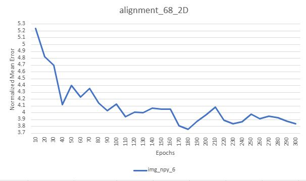
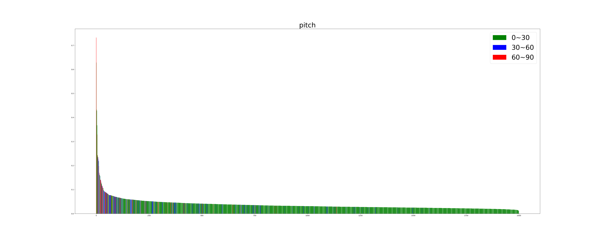
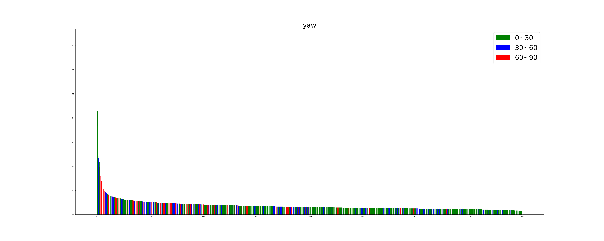
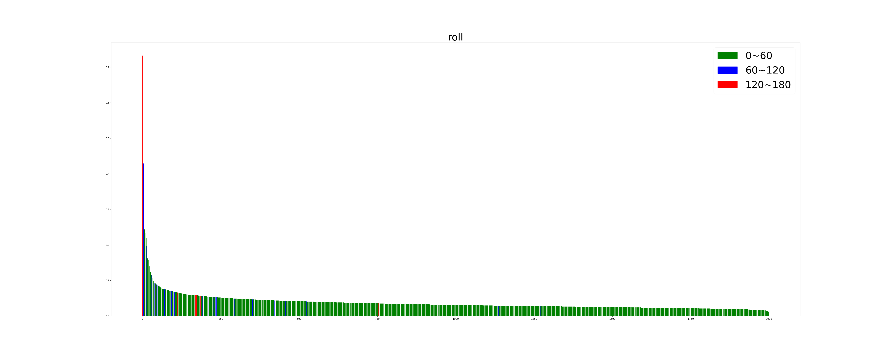
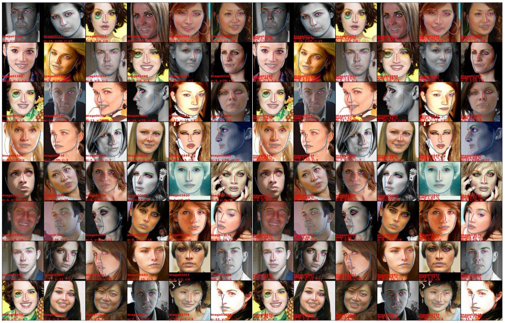
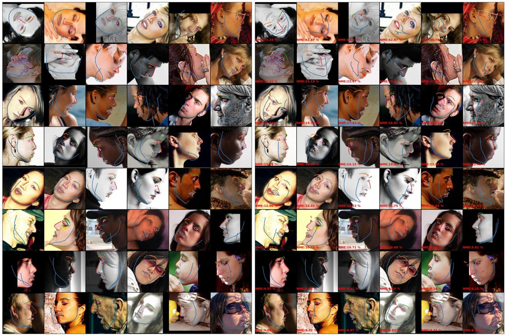

# Image to Position GAN
## Information
- Paper Link: 
- Author: Tzu-Yuan Hsu, Wei-Kai Hsu
- Adivisor: Ming-Der Hsieh
- Institution: National Cheng Kong University (NCKU) Department of Electronical Engineering VLSILAB

## Introduction
- This work is refer to [Joint 3D Face Reconstruction and Dense Alignment with Position Map Regression Network](https://github.com/yfeng95/PRNet), who bring an fasinating idea of using UV-coordinate to store 3D Mesh in 2D expressions. This method brings us a idea for mapping **face reconstruction problem** to **img to img tranlation problem**.

- As for backbone structure, we consult the work [Image-to-Image Translation with Conditional Adversarial Networks](https://arxiv.org/abs/1611.07004), using GAN to solve this task.

- We use AFLW2000-3D as benchmark. Our input img size is 256\*256\*3 (HWC). In the task of face alignment 2D with 68 landmarks, the best grade of Normalized Mean Error (NME) we achieve is **3.754%** in original version, and **3.253%** in re-annotated version by **LS3D-W** (same ckpt).
    - the best NME in re-annotated version is **3.215%**

## Backgroud Information
- frame work: torch 1.10.1

## Perfrormance Analysis
> the result below is produced by best ckpt of model and original version of AFLW2000-3D.

### Ckpt performance tracking
- I store the ckpt every 10 epochs, and the whole traing process is 300 epochs. So I record the 30 NME during training.
  - best grade: **3.754%** at epoch 180
    

### Angle and Error analysis
- Angle distribution of **AFLW2000-3D**
  | angle | 0\~30 (roll:0\~60) | 30\~60 (roll:60\~120) | 60\~90 (roll:120\~12280) |
  | ----- | ------------------ | --------------------- | ------------------------ |
  | pitch | 1814               | 128                   | 58                       |
  | yaw   | 1313               | 383                   | 304                      |
  | roll  | 1931               | 60                    | 9                        |

    - performance
        | angle | 0\~30 (roll:0\~60) | 30\~60 (roll:60\~120) | 60\~90 (roll:120\~12280) | Mean   | Total Mean |
        | ----- | ------------------ | --------------------- | ------------------------ | ------ | ---------- |
        | pitch | 3.44%              | 5.75%                 | 9.32%                    | 6.17%  | 3.75%      |
        | yaw   | 3.28%              | 3.95%                 | 5.55%                    | 4.26%  | 3.75%      |
        | roll  | 3.49%              | 10.08%                | 17.76%                   | 10.44% | 3.75%      |

I sort the NME from largest to smallest and paint each bar according to angle to show the relation between them.
- pitch
    
- yaw
    
- roll
    

### Top 48 best of alignment
- Left: Ground Truth; Right: Generator

### Top 48 worst of alignment
- Left: Ground Truth; Right: Generator

## How to use?